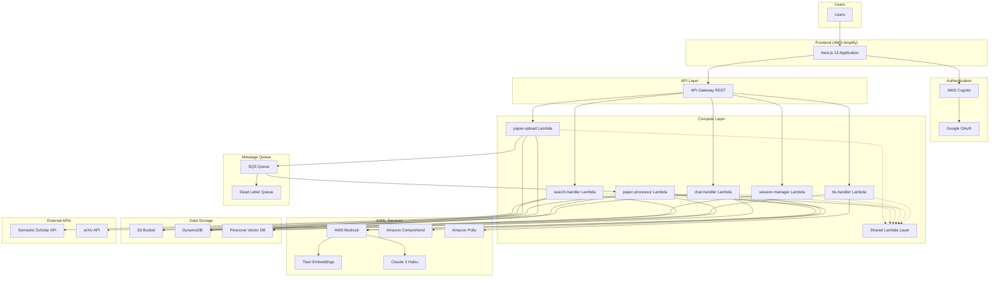
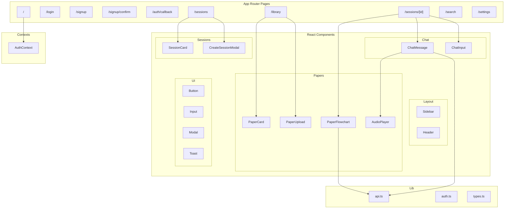
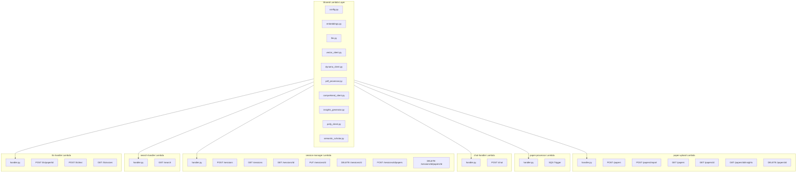
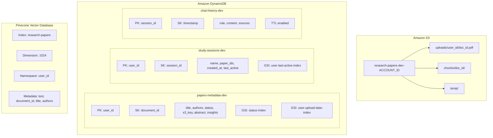
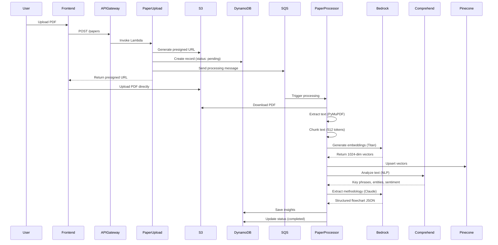
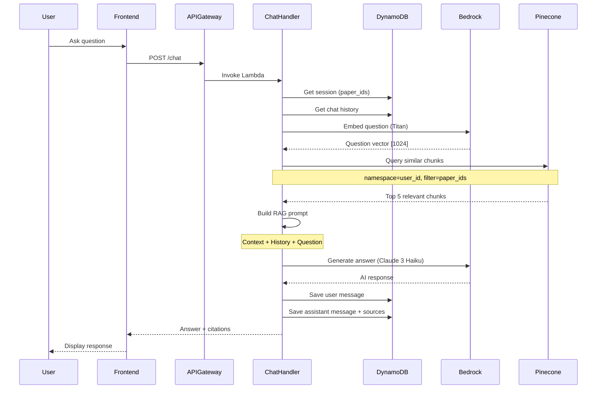
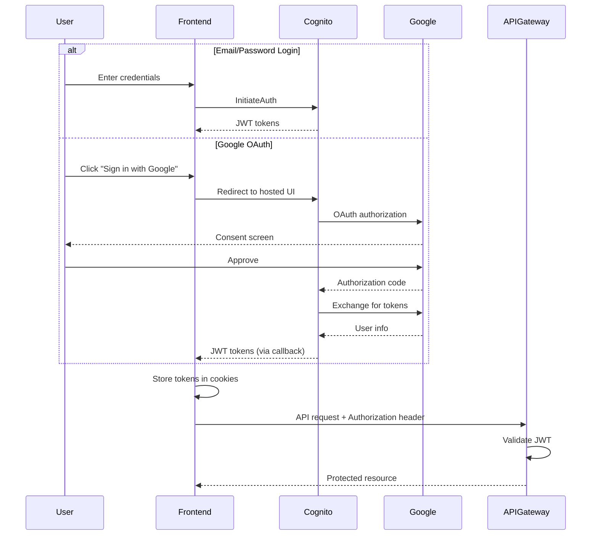
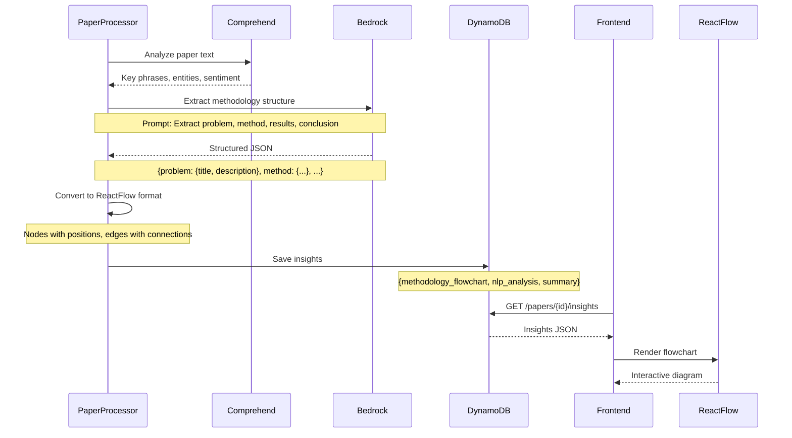

# Research Paper RAG System

A serverless, AI-powered research paper assistant that allows users to upload academic papers, create study sessions, and have intelligent conversations with their documents using Retrieval-Augmented Generation (RAG).

## Table of Contents

- [Overview](#overview)
- [Features](#features)
- [Architecture](#architecture)
  - [High-Level Architecture](#high-level-architecture)
  - [Component Architecture](#component-architecture)
  - [Data Flow Diagrams](#data-flow-diagrams)
- [Technology Stack](#technology-stack)
- [Project Structure](#project-structure)
- [AWS Services Used](#aws-services-used)
- [Getting Started](#getting-started)
  - [Prerequisites](#prerequisites)
  - [Backend Deployment](#backend-deployment)
  - [Frontend Setup](#frontend-setup)
  - [Environment Variables](#environment-variables)
- [API Reference](#api-reference)
- [Data Models](#data-models)
- [Security](#security)

---

## Overview

This system enables researchers and students to:

1. **Upload PDF research papers** to a personal library
2. **Import papers** from Semantic Scholar and arXiv
3. **Create study sessions** by grouping related papers
4. **Ask questions** about papers and receive AI-generated answers with citations
5. **Visualize paper methodology** through auto-generated flowcharts
6. **Listen to responses** via text-to-speech

The backend is fully serverless, running on AWS Lambda with API Gateway. Vector embeddings are stored in Pinecone for semantic search, while metadata is stored in DynamoDB. The LLM (Claude 3 Haiku) and embedding model (Titan) are accessed through AWS Bedrock.

---

## Features

| Feature | Description |
|---------|-------------|
| PDF Upload | Upload research papers with automatic text extraction and chunking |
| External Import | Import papers from Semantic Scholar and arXiv by search or ID |
| Study Sessions | Group papers together for focused Q&A sessions |
| RAG Chat | Ask questions and get answers with source citations |
| Methodology Flowchart | Auto-generated visual representation of paper structure |
| NLP Analysis | Key phrase extraction, entity recognition, and sentiment analysis |
| Text-to-Speech | Listen to AI responses and flowchart content |
| Google OAuth | Sign in with Google for seamless authentication |
| Multi-tenant | Complete data isolation between users |

---

## Architecture

### High-Level Architecture



### Component Architecture

#### Frontend Components



#### Lambda Function Architecture



#### Data Storage Architecture



### Data Flow Diagrams

#### Paper Upload and Processing Flow



#### RAG Chat Flow



#### Authentication Flow



#### Methodology Flowchart Generation



---

## Technology Stack

### Frontend

| Technology | Version | Purpose |
|------------|---------|---------|
| Next.js | 14.x | React framework with App Router |
| React | 18.x | UI library |
| TypeScript | 5.x | Type safety |
| Tailwind CSS | 3.x | Utility-first styling |
| ReactFlow | 11.x | Interactive flowchart visualization |
| Lucide React | - | Icon library |
| clsx | - | Conditional class names |

### Backend

| Technology | Version | Purpose |
|------------|---------|---------|
| Python | 3.11 | Lambda runtime |
| Boto3 | 1.34.x | AWS SDK |
| PyMuPDF | 1.23.x | PDF text extraction |
| Pinecone | 3.x | Vector database client |
| httpx | 0.25.x | HTTP client for external APIs |

### AWS Services

| Service | Purpose |
|---------|---------|
| AWS Amplify | Frontend hosting and CI/CD |
| Amazon Cognito | User authentication and OAuth |
| API Gateway | REST API management |
| AWS Lambda | Serverless compute |
| Amazon S3 | PDF file storage |
| Amazon DynamoDB | Metadata and session storage |
| Amazon SQS | Asynchronous processing queue |
| AWS Bedrock | LLM and embedding models |
| Amazon Comprehend | NLP analysis |
| Amazon Polly | Text-to-speech |
| AWS CloudWatch | Logging and monitoring |
| AWS X-Ray | Distributed tracing |

### External Services

| Service | Purpose |
|---------|---------|
| Pinecone | Vector database for embeddings |
| Google Cloud | OAuth identity provider |
| Semantic Scholar | Academic paper search API |
| arXiv | Preprint paper search API |

---

## Project Structure

```
research-paper-rag/
|
|-- infrastructure/              # AWS SAM infrastructure
|   |-- template.yaml            # CloudFormation template
|   |-- samconfig.toml           # SAM deployment config
|   |-- parameters-dev.json      # Environment parameters
|   |-- deploy.ps1               # Deployment script
|
|-- lambdas/                     # Lambda function code
|   |-- paper-upload/
|   |   |-- handler.py           # Upload, list, delete papers
|   |-- paper-processor/
|   |   |-- handler.py           # PDF processing pipeline
|   |-- chat-handler/
|   |   |-- handler.py           # RAG Q&A handler
|   |-- session-manager/
|   |   |-- handler.py           # Session CRUD operations
|   |-- search-handler/
|   |   |-- handler.py           # Unified search across sources
|   |-- text-to-speech/
|       |-- handler.py           # Amazon Polly TTS
|
|-- shared/                      # Shared Python modules
|   |-- __init__.py
|   |-- config.py                # Environment configuration
|   |-- embeddings.py            # Bedrock Titan embeddings
|   |-- llm.py                   # Bedrock Claude 3 Haiku
|   |-- vector_client.py         # Pinecone operations
|   |-- dynamo_client.py         # DynamoDB operations
|   |-- pdf_processor.py         # PDF extraction and chunking
|   |-- comprehend_client.py     # AWS Comprehend NLP
|   |-- insights_generator.py    # Methodology extraction
|   |-- polly_client.py          # Amazon Polly TTS
|   |-- semantic_scholar.py      # External API client
|
|-- frontend-1/                  # Next.js frontend
|   |-- src/
|   |   |-- app/                 # App Router pages
|   |   |   |-- page.tsx         # Home (redirect)
|   |   |   |-- login/           # Login page
|   |   |   |-- signup/          # Signup pages
|   |   |   |-- auth/callback/   # OAuth callback
|   |   |   |-- library/         # Paper library
|   |   |   |-- sessions/        # Study sessions
|   |   |   |-- search/          # Paper search
|   |   |   |-- settings/        # User settings
|   |   |-- components/          # React components
|   |   |   |-- papers/          # Paper-related components
|   |   |   |-- chat/            # Chat components
|   |   |   |-- sessions/        # Session components
|   |   |   |-- layout/          # Layout components
|   |   |   |-- ui/              # Reusable UI components
|   |   |-- contexts/            # React contexts
|   |   |-- lib/                 # Utilities and API client
|   |-- package.json
|   |-- next.config.mjs
|   |-- tailwind.config.js
|
|-- lambda-layer/                # Lambda layer build artifacts
|-- README.md
```

---

## AWS Services Used

### Compute

**AWS Lambda**
- Runtime: Python 3.11
- Memory: 256MB - 1024MB depending on function
- Timeout: 30s - 900s depending on function
- Layers: Shared code and dependencies

### Storage

**Amazon S3**
- Bucket: `research-papers-{env}-{account_id}`
- Encryption: AES-256 server-side
- Lifecycle rules for cost optimization
- CORS enabled for direct browser uploads

**Amazon DynamoDB**
- Billing: On-demand (pay per request)
- Encryption: AWS managed keys
- Point-in-time recovery: Enabled in production
- TTL: Enabled for chat history

**Pinecone**
- Index dimension: 1024 (Titan v2)
- Metric: Cosine similarity
- Namespaces: Per-user data isolation

### AI/ML

**AWS Bedrock**
- Embedding model: `amazon.titan-embed-text-v2:0`
- LLM: `anthropic.claude-3-haiku-20240307-v1:0`
- Region: us-east-1

**Amazon Comprehend**
- Key phrase extraction
- Named entity recognition
- Sentiment analysis

**Amazon Polly**
- Voice: Joanna (Neural)
- Output format: MP3

### Networking

**API Gateway**
- Type: REST API (Regional)
- Stage: dev/staging/prod
- CORS: Enabled
- Throttling: 50 req/s, burst 100

### Authentication

**Amazon Cognito**
- User Pool with email sign-up
- Google identity provider
- OAuth 2.0 flows: Authorization code, Implicit
- Token validity: Access 1h, Refresh 30d

### Monitoring

**Amazon CloudWatch**
- Lambda function logs
- API Gateway access logs
- Custom metrics and alarms

**AWS X-Ray**
- Distributed tracing enabled on all Lambdas

---

## Getting Started

### Prerequisites

1. **AWS Account** with appropriate permissions
2. **AWS CLI** configured with credentials
3. **AWS SAM CLI** for infrastructure deployment
4. **Node.js 18+** for frontend development
5. **Python 3.11** for Lambda development
6. **Pinecone Account** with an index created
7. **Google Cloud Project** with OAuth credentials (optional)

### Backend Deployment

1. **Clone the repository**

```bash
git clone https://github.com/yourusername/research-paper-rag.git
cd research-paper-rag
```

2. **Create the Lambda Layer**

```bash
cd lambda-layer
mkdir python
pip install -r requirements.txt -t python/
cp -r ../shared python/
zip -r layer.zip python/
aws lambda publish-layer-version \
  --layer-name research-paper-rag-shared \
  --zip-file fileb://layer.zip \
  --compatible-runtimes python3.11
```

3. **Configure deployment parameters**

Edit `infrastructure/samconfig.toml`:

```toml
[default.deploy.parameters]
stack_name = "research-paper-rag-dev"
region = "us-east-1"
parameter_overrides = """
  Environment=dev
  PineconeApiKey=your-pinecone-api-key
  PineconeIndexName=research-papers
  PineconeHost=your-index-host.pinecone.io
  SharedLayerArn=arn:aws:lambda:us-east-1:ACCOUNT:layer:research-paper-rag-shared:VERSION
  PaperUploadRoleArn=arn:aws:iam::ACCOUNT:role/paper-upload-role
  PaperProcessorRoleArn=arn:aws:iam::ACCOUNT:role/paper-processor-role
  ChatHandlerRoleArn=arn:aws:iam::ACCOUNT:role/chat-handler-role
  SessionManagerRoleArn=arn:aws:iam::ACCOUNT:role/session-manager-role
  SearchHandlerRoleArn=arn:aws:iam::ACCOUNT:role/search-handler-role
  TTSHandlerRoleArn=arn:aws:iam::ACCOUNT:role/tts-handler-role
  GoogleClientId=your-google-client-id
  GoogleClientSecret=your-google-client-secret
  FrontendUrl=https://your-amplify-app.amplifyapp.com
"""
```

4. **Deploy with SAM**

```bash
cd infrastructure
sam build
sam deploy
```

5. **Note the outputs**

After deployment, note these values from CloudFormation outputs:
- `ApiEndpoint`
- `CognitoUserPoolId`
- `CognitoUserPoolClientId`
- `CognitoDomain`

### Frontend Setup

1. **Install dependencies**

```bash
cd frontend-1
npm install
```

2. **Configure environment variables**

Create `.env.local`:

```bash
NEXT_PUBLIC_API_URL=https://your-api-id.execute-api.us-east-1.amazonaws.com/dev
NEXT_PUBLIC_COGNITO_USER_POOL_ID=us-east-1_XXXXXXXXX
NEXT_PUBLIC_COGNITO_CLIENT_ID=your-client-id
NEXT_PUBLIC_COGNITO_DOMAIN=https://your-domain.auth.us-east-1.amazoncognito.com
NEXT_PUBLIC_AWS_REGION=us-east-1
```

3. **Run development server**

```bash
npm run dev
```

4. **Build for production**

```bash
npm run build
```

5. **Deploy to AWS Amplify**

- Connect your GitHub repository to AWS Amplify
- Configure build settings (Next.js preset)
- Add environment variables in Amplify Console
- Deploy

### Environment Variables

#### Backend (Lambda)

| Variable | Description |
|----------|-------------|
| `AWS_REGION_NAME` | AWS region |
| `ENVIRONMENT` | dev/staging/prod |
| `S3_BUCKET_NAME` | Paper storage bucket |
| `PAPERS_TABLE` | DynamoDB papers table |
| `SESSIONS_TABLE` | DynamoDB sessions table |
| `CHAT_HISTORY_TABLE` | DynamoDB chat table |
| `PROCESSING_QUEUE_URL` | SQS queue URL |
| `PINECONE_API_KEY` | Pinecone API key |
| `PINECONE_INDEX_NAME` | Pinecone index name |
| `PINECONE_HOST` | Pinecone host URL |
| `VECTOR_DB_PROVIDER` | "pinecone" |
| `EMBEDDING_PROVIDER` | "bedrock" |
| `LLM_PROVIDER` | "bedrock" |

#### Frontend

| Variable | Description |
|----------|-------------|
| `NEXT_PUBLIC_API_URL` | API Gateway endpoint |
| `NEXT_PUBLIC_COGNITO_USER_POOL_ID` | Cognito User Pool ID |
| `NEXT_PUBLIC_COGNITO_CLIENT_ID` | Cognito App Client ID |
| `NEXT_PUBLIC_COGNITO_DOMAIN` | Cognito hosted UI domain |
| `NEXT_PUBLIC_AWS_REGION` | AWS region |

---

## API Reference

### Papers API

| Method | Endpoint | Description |
|--------|----------|-------------|
| POST | `/papers` | Upload a new paper (returns presigned URL) |
| POST | `/papers/import` | Import paper from external source |
| GET | `/papers` | List all papers for user |
| GET | `/papers/{document_id}` | Get paper details |
| GET | `/papers/{document_id}/insights` | Get paper insights and flowchart |
| DELETE | `/papers/{document_id}` | Delete a paper |

### Sessions API

| Method | Endpoint | Description |
|--------|----------|-------------|
| POST | `/sessions` | Create a new study session |
| GET | `/sessions` | List all sessions for user |
| GET | `/sessions/{session_id}` | Get session with papers |
| PUT | `/sessions/{session_id}` | Update session name |
| DELETE | `/sessions/{session_id}` | Delete a session |
| POST | `/sessions/{session_id}/papers` | Add paper to session |
| DELETE | `/sessions/{session_id}/papers/{document_id}` | Remove paper from session |

### Chat API

| Method | Endpoint | Description |
|--------|----------|-------------|
| POST | `/chat` | Send a message and get RAG response |

Request body:
```json
{
  "user_id": "user-123",
  "session_id": "session-456",
  "question": "What is the main contribution?",
  "include_history": true
}
```

Response:
```json
{
  "answer": "The main contribution is...",
  "sources": [
    {
      "document_id": "doc-789",
      "title": "Paper Title",
      "authors": "Author Names",
      "relevance_score": 0.89
    }
  ],
  "session_id": "session-456",
  "chunks_used": 5
}
```

### Search API

| Method | Endpoint | Description |
|--------|----------|-------------|
| GET | `/search?q={query}&sources={sources}` | Search papers across sources |

### TTS API

| Method | Endpoint | Description |
|--------|----------|-------------|
| POST | `/tts/paper/{document_id}` | Synthesize paper summary |
| POST | `/tts/text` | Synthesize arbitrary text |
| GET | `/tts/voices` | List available voices |

---

## Data Models

### Paper

```typescript
interface Paper {
  document_id: string;      // UUID
  user_id: string;          // Cognito sub
  title: string;
  authors: string;
  abstract?: string;
  status: 'pending' | 'processing' | 'completed' | 'failed';
  upload_date: string;      // ISO 8601
  s3_key?: string;
  source: 'upload' | 'arxiv' | 'semantic_scholar';
  chunk_count?: number;
  insights?: PaperInsights;
}
```

### Session

```typescript
interface Session {
  session_id: string;       // UUID
  user_id: string;          // Cognito sub
  name: string;
  paper_ids: string[];
  created_at: string;       // ISO 8601
  last_active: string;      // ISO 8601
}
```

### Chat Message

```typescript
interface ChatMessage {
  session_id: string;
  timestamp: string;        // ISO 8601
  role: 'user' | 'assistant';
  content: string;
  sources?: SourceCitation[];
  ttl?: number;             // Unix timestamp for expiry
}
```

### Paper Insights

```typescript
interface PaperInsights {
  document_id: string;
  methodology_flowchart: {
    nodes: FlowchartNode[];
    edges: FlowchartEdge[];
  };
  nlp_analysis: {
    key_phrases: Array<{text: string; score: number}>;
    entities: Record<string, Array<{text: string; score: number}>>;
    sentiment: {
      sentiment: 'POSITIVE' | 'NEGATIVE' | 'NEUTRAL' | 'MIXED';
      scores: Record<string, number>;
    };
  };
  summary?: string;
  generated_at: string;
}
```

---

## Security

### Authentication

- All API endpoints require authentication via JWT tokens
- Tokens are validated by API Gateway
- Cognito handles password hashing and storage
- OAuth 2.0 with PKCE for Google sign-in

### Authorization

- Users can only access their own data
- DynamoDB: `user_id` is partition key
- Pinecone: `user_id` is namespace
- S3: Objects stored under `uploads/{user_id}/`

### Data Protection

- S3: Server-side encryption (AES-256)
- DynamoDB: Encryption at rest with AWS managed keys
- API Gateway: HTTPS only
- Cognito: Secure password policies

### Network Security

- Lambda functions run in AWS-managed VPC
- API Gateway throttling prevents abuse
- CORS configured for frontend domain only in production

---

## Contributing

1. Fork the repository
2. Create a feature branch (`git checkout -b feature/amazing-feature`)
3. Commit your changes (`git commit -m 'Add amazing feature'`)
4. Push to the branch (`git push origin feature/amazing-feature`)
5. Open a Pull Request

---

## Acknowledgments

- AWS for the serverless infrastructure
- Anthropic for Claude 3 Haiku
- Pinecone for vector database
- Semantic Scholar and arXiv for paper APIs
